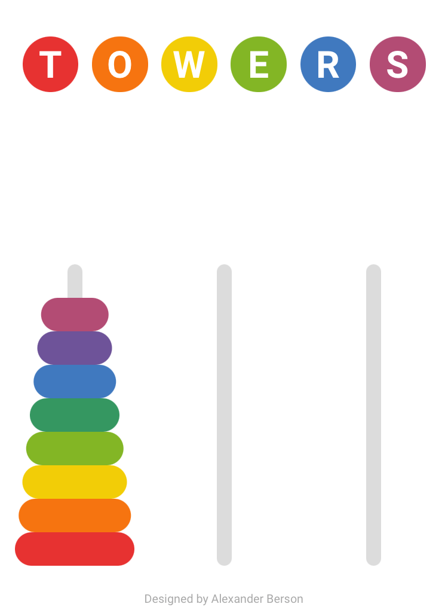

# Towers

Move all disks to another rod.  
You can [play Towers online](https://alex-berson.github.io/towers/) or  

**SPOILER ALERT!** You can also [watch an AI solving Towers in the fewest possible moves](https://alex-berson.github.io/towers/?mode=ai) (duration: approx. 2 mins).

## Description

**Towers**, also known as **Tower of Hanoi**, **Tower of Brahma**, or simply **pyramid puzzle**, is a puzzle involving three vertical rods and a set of different sized disks with holes through their centers. The disks are initially placed on one of the rods, with the largest disk on the bottom and the smallest on top. The task is to transfer the entire stack to one of the other rods, subject to two rules: only individual disks may be moved, and no disk may be placed on a smaller disk.

## Screenshot

  

## License

Copyright &copy; 2025 Alexander Berson. This project is licensed under the [MIT license](LICENSE.txt "MIT License").